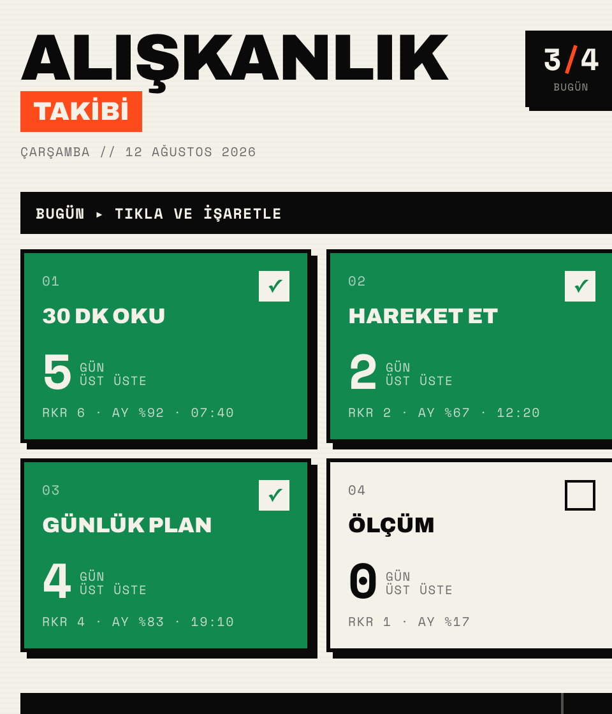

<h1 align="center">Alışkanlık Takibi</h1>

<p align="center">
  <strong>Bir dokunuşla günü kaydet. Seri, oran ve zaman dağılımını uygulama hesaplasın.</strong>
</p>

<p align="center">
  
  
  
  
  
</p>

<p align="center">
  
</p>

<p align="center"><sub>Görsel yalnızca tanıtım için üretilmiş örnek veriler içerir.</sub></p>

Telefon için tasarlanmış, tek kullanıcılı ve kendi sunucunda çalıştırabileceğin bir alışkanlık
takip uygulaması. Veriler SQLite içinde kalır; arayüz telefona PWA olarak yüklenebilir.

## Neler yapar?

- Günlük alışkanlığı tek dokunuşla tamamlar ve saati otomatik kaydeder.
- Güncel seri, kişisel rekor, aylık tamamlanma oranı ve saat dağılımını hesaplar.
- Son 90 günü ısı haritasında gösterir; geçmiş günleri sonradan düzeltir.
- Kilo, bel veya kendi tanımladığın ölçümleri alışkanlıkla birlikte kaydeder.
- Google Tasks görevlerini listeler, ekler, düzenler ve tamamlar; görev içindeki bağlantıları açar.
- İnternet kesildiğinde uygulama kabuğunu önbellekten açan, yüklenebilir PWA deneyimi sunar.

## Hızlı başlangıç

Gerekenler: **Node.js 22+** ve npm.

```bash
git clone https://github.com/yasinozmeen/aliskanlik.git
cd aliskanlik
npm install
cp .env.example .env.local
npm run dev
```

Uygulama `http://localhost:3000` adresinde açılır. Yerel geliştirmede giriş ekranı atlanır;
üretimde `APP_PASSWORD` ve güçlü, benzersiz bir `AUTH_SECRET` zorunludur.

Güvenli bir anahtar üretmek için:

```bash
openssl rand -hex 32
```

## Yapılandırma

| Değişken | Zorunlu | Açıklama |
|---|:---:|---|
| `APP_PASSWORD` | Üretimde | Uygulamanın tek kullanıcı giriş şifresi |
| `AUTH_SECRET` | Üretimde | Oturum çerezini imzalayan gizli anahtar |
| `DATA_DIR` | Hayır | SQLite klasörü; varsayılan `./data` |
| `GOOGLE_CLIENT_ID` | Hayır | Google Tasks OAuth istemci kimliği |
| `GOOGLE_CLIENT_SECRET` | Hayır | Google Tasks OAuth istemci sırrı |
| `GOOGLE_REFRESH_TOKEN` | Hayır | Google Tasks yenileme anahtarı |
| `GOOGLE_TASKLIST` | Hayır | Kullanılacak görev listesi; varsayılan `@default` |

Google değişkenleri boş bırakılırsa alışkanlık takibi çalışmaya devam eder ve görev bölümü
bağlantının kurulmadığını açıkça gösterir.

## Docker ile çalıştırma

```bash
docker build -t aliskanlik .
docker run --rm \
  --name aliskanlik \
  -p 3000:3000 \
  --env-file .env.local \
  -e DATA_DIR=/data \
  -v "$PWD/data:/data" \
  aliskanlik
```

`data/` klasörünü düzenli yedekle. Alışkanlıklar, geçmiş ve ölçümler bu klasördeki SQLite
veritabanında tutulur.

## Mimari

```text
app/
├── dashboard.tsx       Ana ekran ve Google Tasks etkileşimleri
├── gecmis/             Son 90 günü düzenleme
├── olcumler/           Ölçüm kayıt defteri
├── ayarlar/            Alışkanlık ve ölçüm alanı yönetimi
└── api/                 Auth, durum, görev, alışkanlık ve ölçüm uçları

lib/
├── db.ts               SQLite şeması, geçişler ve başlangıç verisi
├── logic.ts            Seri, oran, dağılım ve ısı haritası hesapları
├── gtasks.ts           Google Tasks bağlantısı
└── auth.ts             HMAC imzalı tek kullanıcı oturumu
```

| Katman | Tercih |
|---|---|
| Uygulama | Next.js 16 App Router · React 19 · TypeScript |
| Veri | better-sqlite3 · WAL modu |
| Arayüz | Tailwind CSS 4 · Archivo · Hanken Grotesk · Space Mono |
| PWA | Web app manifest · network-first service worker |
| Dağıtım | Standalone Next.js çıktısı · Docker |

## Veri ve güvenlik

- `.env*`, `data/`, SQLite dosyaları ve yerel çalışma notları Git dışında tutulur.
- Üretim, `AUTH_SECRET` eksikse öngörülebilir bir oturum anahtarıyla başlamaz.
- Google erişim anahtarı bellekte yenilenir; repoya kimlik bilgisi yazılmaz.
- Bu proje tek kullanıcı içindir. İnternete açarken HTTPS sağlayan bir ters proxy kullan.

## Doğrulama

```bash
npm run typecheck
npm run build
npm audit --omit=dev
```

## Projenin geçmişi

Uygulama 2026'da Google Sheets + Apps Script sürümünden Next.js ve SQLite'a taşındı.
Eski sürüm yalnız yerel arşiv olarak korunur; bu repodaki uygulamanın çalışma yoluna dahil değildir.
